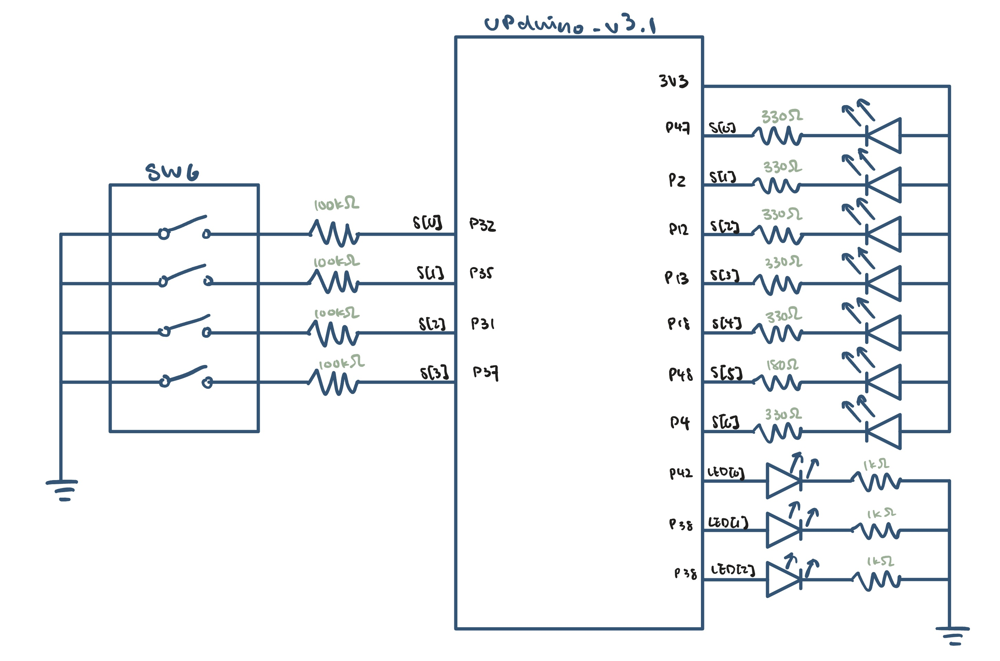

# Introduction
In this lab, a verilog design was implemented on the FPGA to:
1. control a 7-segment LED to display a single hexadecimal digit with a 4-Position DIP switch 
digits
2. switch two onboard LEDs on and off with a 4-Position DIP switch
3. blink a onboard LED at a frequency of 2.4 Hz with the onboard high-speed oscillator.

The high speed oscillator was configured at a frequency of 24 MHz and divided down using a counter to achieve a blinking frequency of ~2.4 Hz.

# Design and Testing Methodology
The top module of this lab contains the internal high speed oscillator from the iCE40 UltraPlus primitive library to generate a clock signal at 24 MHz, switch-to-LED assign logic to turn two onbaord LEDs on and off, and instantiates 'blinker' and 'seven_segment_display'.

`seven_segment_display` is a combinational logic circuit designed to control the 7-segment LED display and the onboard LEDs based on the input from the DIP switches. 

`blinker` is a flip-flop that takes the clock signal from the high-speed oscillator and uses it to set the blinking frequency of a onboard LEDat 2.4 Hz.

# Technical Documentation

The source code for the project can be found in the associated [Github repository](https://github.com/kathy-guo811/e155-lab1).

### Schematic

Figure 1 shows the physical layout of the design. The pins connected to s[3:0] were configured with 100kΩ pull-up resistors to avoid invalid logic levels The output LED was connected using a current-limiting resistor to ensure the output current did not exceed the maximum output current of the FPGA I/O pins. The resistor value varies to ensure all segments are equally bright. The onboard LEDs were connected current limiting resistors and GPIO pins of the FPGA to perform their intended tasks.

#### Resistor Calculations
To limit the current through the LEDs with 5-20 mA, the following calculations were performed using Ohm's Law:
$$V = IR$$
$$R1 = \frac{3.3V}{330Ω} = 10mA$$
$$R2 = \frac{3.3V}{180Ω} = 18.3mA$$

### Block Diagram

Figure 2 shows the block diagram of the design. The top-level module `lab1_kg` includes three submodules: the high-speed oscillator block (`HSOSC`), the clock divider module(`blinker`), and the seven-segment display module(`seven_segment_display`). 

#### Frequency Calculations
Given the frequency generated by the osciloscope is 24 MHz, the clock divider module was designed to divide the frequency down to 2.4 Hz. The following calculations were performed to determine the number of clock cycles, N, required for the desired frequency:
$$f_{out} = \frac{f_{in}}{N}$$
$$2.4 Hz = \frac{24 MHz}{N}$$
$$N = \frac{24 MHz}{2.4 Hz} = 10^7$$

Therefore, the a 24-bit counter was implemented to count up to 10^7 clock cycles before toggling the output signal to achieve the desired blinking frequency of 2.4 Hz.

# Results and Discussion
### Testbench Simulation

The design met all intended design objectives. The above figures show screenshots of the QuestaSim simulation waveforms for the `seven_segment_display`, `blinker`, and top-level, `lab1_kg`,module. 

# Conclusion

The design successfully implemented the intended functionality of controlling a 7-segment LED display, switching two onboard LEDs on and off, and blinking an onboard LED at a frequency of 2.4 Hz using the high-speed oscillator. I spent around 25 hours working on this lab.

*Comment: It would be helpful to include a tutorial for syncing .sv files from Radient to GitHub, what files are needed in the final submission, and what to include in the .gitignore file?*

# AI Prototype Summary