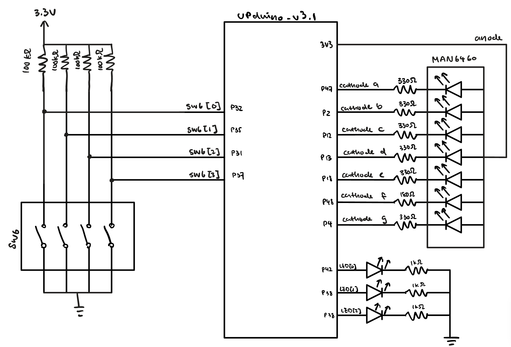
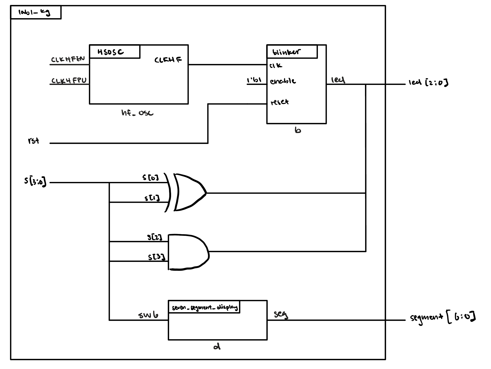
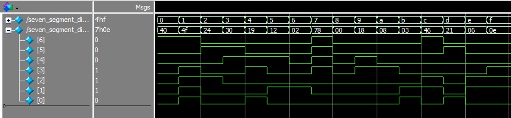
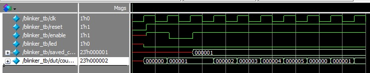
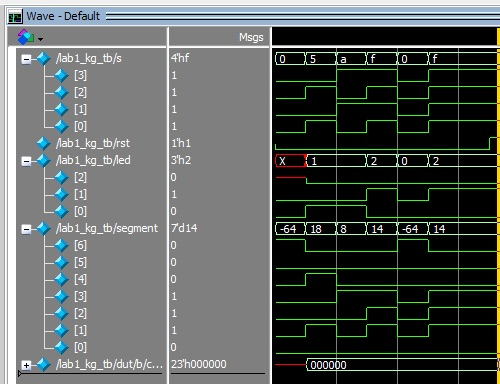
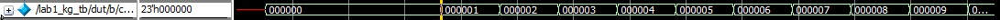

# Introduction
In this lab, a verilog design was implemented on the FPGA to:
1. control a 7-segment LED to display a single hexadecimal digit with a 4-Position DIP switch 
digits
2. switch two onboard LEDs on and off with a 4-Position DIP switch
3. blink a onboard LED at a frequency of 2.4 Hz with the onboard high-speed oscillator.

The high speed oscillator was configured at a frequency of 24 MHz and divided down using a counter to achieve a blinking frequency of ~2.4 Hz.

# Design and Testing Methodology
The top module of this lab contains the internal high speed oscillator from the iCE40 UltraPlus primitive library to generate a clock signal at 24 MHz, switch-to-LED assign logic to turn two onbaord LEDs on and off, and instantiates 'blinker' and 'seven_segment_display'.

`seven_segment_display` is a combinational logic circuit designed to control the 7-segment LED display and the onboard LEDs based on the input from the DIP switches. 

`blinker` is a flip-flop that takes the clock signal from the high-speed oscillator and uses it to set the blinking frequency of a onboard LEDat 2.4 Hz.

# Technical Documentation

The source code for the project can be found in the associated [Github repository](https://github.com/kathy-guo811/e155-lab1).

### Schematic

Figure 1 shows the physical layout of the design. The pins connected to s[3:0] were configured with 100kΩ pull-up resistors to avoid invalid logic levels The output LED was connected using a current-limiting resistor to ensure the output current did not exceed the maximum output current of the FPGA I/O pins. The resistor value varies to ensure all segments are equally bright. The onboard LEDs were connected current limiting resistors and GPIO pins of the FPGA to perform their intended tasks.

#### Resistor Calculations
To limit the current through the LEDs and ensure all segments are equally bright, the following calculations were performed using Ohm's Law:
$$V = IR$$
$$R1 = \frac{3.3V-2.1V}{330Ω} = 3.64mA$$
$$R2 = \frac{3.3V-2.1V}{180Ω} = 6.67mA$$

### Block Diagram

Figure 2 shows the block diagram of the design. The top-level module `lab1_kg` includes three submodules: the high-speed oscillator block (`HSOSC`), the clock divider module(`blinker`), and the seven-segment display module(`seven_segment_display`). 

#### Frequency Calculations
Given the frequency generated by the osciloscope is 24 MHz, the clock divider module was designed to divide the frequency down to 2.4 Hz. The following calculations were performed to determine the number of clock cycles, N, required for the desired frequency:
$$f_{out} = \frac{f_{in}}{N}$$
$$2.4 Hz = \frac{24 MHz}{N}$$
$$N = \frac{24 MHz}{2.4 Hz} = 10^7$$

Therefore, the a 24-bit counter was implemented to count up to 10^7 clock cycles before toggling the output signal to achieve the desired blinking frequency of 2.4 Hz.

# Results and Discussion
### Testbench Simulation

The design met all intended design objectives. The above figures show screenshots of the QuestaSim simulation waveforms for the `seven_segment_display`, `blinker`, and top-level, `lab1_kg`,module. 

The `seven_segment_display` module was tested with all possible combinations of the 4-position DIP switch inputs, and the output waveform shows that the correct segments of the 7-segment LED display were turned on for each input combination.

The `blinker` module was tested with the 24 MHz clock signal from the high-speed oscillator, with `'max_count' set to 5 to show the toggling of the output signal.

The `top module` was tested with the 24 MHz clock signal from the high-speed oscillator, and the output waveform shows that two onboard LEDs are turning on and off, and the counter is incrementing.

# Conclusion

The design successfully implemented the intended functionality of controlling a 7-segment LED display, switching two onboard LEDs on and off, and blinking an onboard LED at a frequency of 2.4 Hz using the high-speed oscillator. I spent around 25 hours working on this lab.

# AI Prototype Summary

::: {.callout-note appearance="simple" title="Expand to see FPGA code generated by Gemini" icon=false collapse="true"}

`// Top-level SystemVerilog module for Lattice iCE40UP5K
module top (
    output logic led_o
);

    // Constant parameters
    localparam int CLK_FREQ_HZ = 24_000_000;
    localparam int BLINK_FREQ_HZ = 2;
    
    // Calculate cycles needed for each half-period toggle
    localparam int TOGGLE_CYCLES = CLK_FREQ_HZ / (BLINK_FREQ_HZ * 2);
    localparam int COUNTER_WIDTH = $clog2(TOGGLE_CYCLES);

    // Internal logic signals
    logic clk_24mhz;
    logic [COUNTER_WIDTH-1:0] counter = '0;

    // Instantiate the Lattice iCE40 High-Speed Oscillator hard IP component
    HSOSC #(
        .CLKHF_DIV("0b00") // 0b00 = 24 MHz, 0b01 = 12 MHz, 0b10 = 6 MHz, 0b11 = 3 MHz
    ) hf_osc_inst (
        .CLKHFPU(1'b1),    // Power up the oscillator (1 = active, 0 = powered down)
        .CLKHFEN(1'b1),    // Enable the clock output
        .CLKHF  (clk_24mhz) // Oscillator clock output connection
    );

    // Counter and LED toggle logic
    always_ff @(posedge clk_24mhz) begin
        if (counter == TOGGLE_CYCLES - 1) begin
            counter <= '0;
            led_o   <= ~led_o;
        end else begin
            counter <= counter + 1'b1;
        end
    end

endmodule`

:::

The quality of the output looks decent as it contains configurable parameters for the clock frequency and blink frequency, as well as a clear structure for the top-level module. However, when instantiating the HSOSC module, the LLM used a different value to configure .CLKHF_DIV than what was used in the lab. The lab used "2'b01" for 24 MHz, while the LLM used "0b00" for 24 MHz, which is incorrect according to the Lattice iCE40 documentation. 

The LLM-generated code introduced the use of `localparam` for defining constant parameters and used the `$clog2` function to calculate the width of the counter based on the number of toggle cycles, both of which were new to me. 

The LLM-generated code did synthesize successfully the first time with no error or warning messages, but the incorrect configuration of the HSOSC module would have caused issues with the clock frequency.

When using an LLM in my workflow next time, I would cross check the generated code with the official documentation to ensure that all configurations and parameters are correct. 