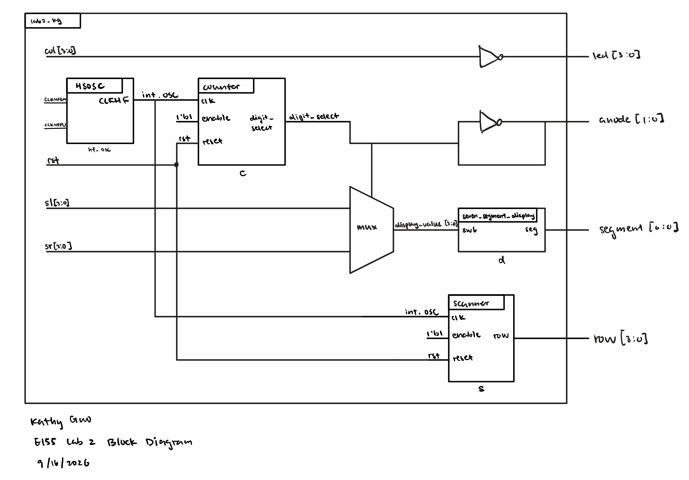
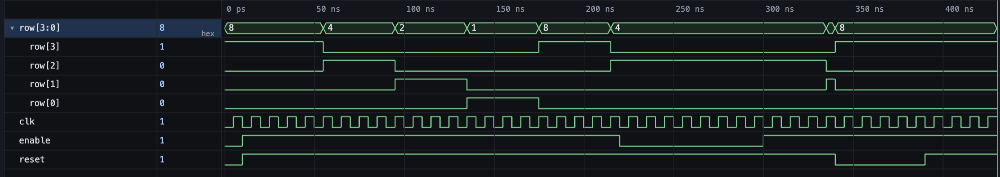

# Introduction
In this lab, a verilog design was implemented on the FPGA to:
1. implement a time-muxing scheme to drive two seven-segment displays with a single set of FPGA I/O pins. 
2. build a transistor circuit to verified that logic signals can pass through it a keypad.

The high speed oscillator was configured at a frequency of 24 MHz and divided down using a counter to achieve a blinking frequency of ~2.4 Hz.

# Design and Testing Methodology
The top module of this lab contains the internal high speed oscillator from the iCE40 UltraPlus primitive library to generate a clock signal at 24 MHz, a `seven_segment_display` module, a multiplexing `scanner` module, and assign statements to implement multiplexing and scanning of the keypad.

# Technical Documentation

The source code for the project can be found in the associated [Github repository](https://github.com/kathy-guo811/e155-lab2).

### Schematic

Figure 1 shows the physical layout of the design. The pins connected to s[3:0] were configured with 100kΩ pull-up resistors to avoid invalid logic levels The output LED was connected using a current-limiting resistor to ensure the output current did not exceed the maximum output current of the FPGA I/O pins. The resistor value varies to ensure all segments are equally bright. The onboard LEDs were connected current limiting resistors and GPIO pins of the FPGA to perform their intended tasks.

#### Resistor Calculations
LED resistor:
$$V = IR$$
$$R1 = \frac{3.3V}{100Ω} = 33mA$$
$$R2 = \frac{3.3V}{100Ω}= 33mA$$

transistor  resistor:
$$V = IR$$
$$R1 = \frac{3.3V}{100Ω} = 33mA$$
$$R2 = \frac{3.3V}{100Ω}= 33mA$$

### Block Diagram

Figure 2 shows the block diagram of the design. The top-level module `lab2_kg` includes the high-speed oscillator block (`HSOSC`), `counter` for time-multiplexging, `blinker` for scannign the keypad, and the seven-segment display module(`seven_segment_display`). 

#### Frequency Calculations
Given the frequency generated by the osciloscope is 24 MHz, the clock divider module was designed to divide the frequency down to 2.4 Hz. The following calculations were performed to determine the number of clock cycles, N, required for the desired frequency:
$$f_{out} = \frac{f_{in}}{N}$$
$$2.4 Hz = \frac{24 MHz}{N}$$
$$N = \frac{24 MHz}{2.4 Hz} = 10^7$$

The frequency of the counter was set to 1 kHz to ensure that the two seven-segment displays are multiplexed at a frequency that is fast enough to avoid flickering. The following calculations were performed to determine the number of clock cycles, N, required for the desired frequency:
$$f_{out} = \frac{f_{in}}{N}$$
$$1 kHz = \frac{24 MHz}{N}$$
$$N = \frac{24 MHz}{1 kHz} = 24000$$

# Results and Discussion
### Testbench Simulation

# Conclusion

# AI Prototype Summary

::: {.callout-note appearance="simple" title="Expand to see FPGA code generated by Gemini" icon=false collapse="true"}

