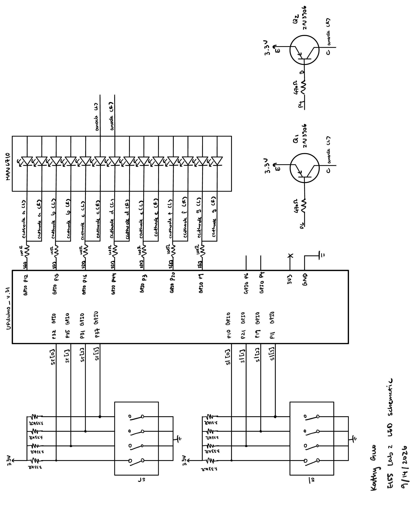
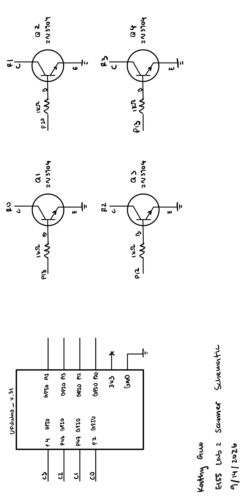
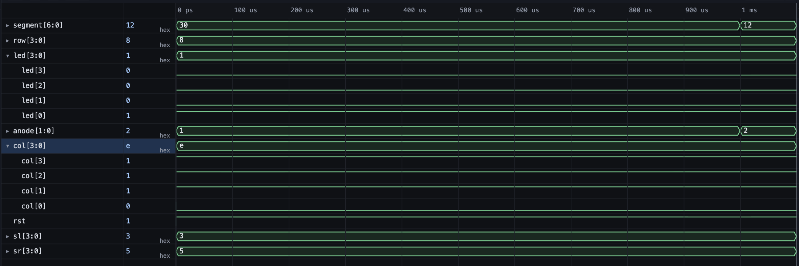

# Introduction
In this lab, a verilog design was implemented on the FPGA to:
1. implement a time-multiplexing scheme to drive two seven-segment displays with a single set of FPGA I/O pins. 
2. build a transistor circuit to verify that logic signals can pass through it via a keypad.

The high speed oscillator was configured at a frequency of 24 MHz and divided down using a counter to achieve a blinking frequency of ~2.4 Hz.

# Design and Testing Methodology
The top module of this lab contains the internal high speed oscillator from the iCE40 UltraPlus primitive library to generate a clock signal at 24 MHz, a `seven_segment_display` module, a multiplexing `scanner` module, and assign statements to implement multiplexing and scanning of the keypad.


# Technical Documentation

The source code for the project can be found in the associated [Github repository](https://github.com/kathy-guo811/e155-lab2).

### Schematic
::: {.callout-note appearance="simple" title="Expand to see Lab 2 Schematic" icon=false collapse="true"}



:::

#### Resistor Calculations

LED transistor resistor:

The I_OL of the LVCMOS 3.3 is 8 mA.. According to the 2N3906 datasheet, the I_B of the transistor is I_C/10, which, in this case, is 0.0056 A. The V_BE of the transistor is typically 0.7 V. Therefore, the resistor value can be calculated as follows:
$$R_{LED\:transistor} = \frac{3.3V-0.4V-0.7V}{0.0056A} \approx 470Ω$$

Keypad transistor resistor:

According to the 2N3904 datasheet, the I_B of the transistor is I_C/10, where I_C is 0.02 A. The V_BE of the transistor is typically 0.7 V. Therefore, the resistor value can be calculated as follows:
$$R_{keypad\:transistor} = \frac{3.3V-0.7V}{0.002A} \approx 1000Ω$$

### Block Diagram
::: {.callout-note appearance="simple" title="Expand to see Lab 2 Block Diagram" icon=false collapse="true"}


Figure 2 shows the block diagram of the design. The top-level module `lab2_kg` includes the high-speed oscillator block (`HSOSC`), `counter` for time-multiplexging, `blinker` for scannign the keypad, and the seven-segment display module(`seven_segment_display`). 
:::

#### Frequency Calculations
Given the frequency generated by the osciloscope is 24 MHz, the clock divider module was designed to divide the frequency down to 2.4 Hz. The following calculations were performed to determine the number of clock cycles, N, required for the desired frequency:
$$f_{out} = \frac{f_{in}}{N}$$
$$2.4 Hz = \frac{24 MHz}{N}$$
$$N = \frac{24 MHz}{2.4 Hz} = 10^7$$

The frequency of the counter was set to 1 kHz to ensure that the two seven-segment displays are multiplexed at a frequency that is fast enough to avoid flickering. The following calculations were performed to determine the number of clock cycles, N, required for the desired frequency:
$$f_{out} = \frac{f_{in}}{N}$$
$$1 kHz = \frac{24 MHz}{N}$$
$$N = \frac{24 MHz}{1 kHz} = 24000$$

# Results and Discussion
### Testbench Simulation
::: {.callout-note appearance="simple" title="Expand to see Lab 2 Simulation Results" icon=false collapse="true"}




:::

Figure 4 shows the waveform of the top-level testbench simulation, which verifies the functionality of the entire design. The simulation confirms that the seven-segment displays are multiplexing and that the LED driver is functioning correctly.

Figure 5 shows the waveform of the scanner testbench simulation, which demonstrates all four output transitionss, as well as the enable and reset features.

# Conclusion

The design was successfully implemented on the FPGA and verified through simulation and physical testing. The time-multiplexing scheme effectively controlled two seven-segment displays using a single set of I/O pins, and the transistor circuit allowed for successful signal transmission through the keypad. The calculated resistor values ensured proper current limiting for both the LEDs and transistors, maintaining safe operating conditions for all components.

# AI Prototype Summary

::: {.callout-note appearance="simple" title="AI Prototype Part 1: Expand to see FPGA code generated by Gemini" icon=false collapse="true"}

```
module top_display_multiplexer #(
    parameter integer CLK_FREQ = 50_000_000, // Input clock frequency in Hz
    parameter integer REFRESH_RATE = 1000    // Desired display refresh rate in Hz
)(
    input  logic       clk,         // Main clock input
    input  logic       rst,         // Active-high asynchronous reset
    input  logic [3:0] in0,         // First 4-bit input
    input  logic [3:0] in1,         // Second 4-bit input
    output logic [6:0] seg_n,       // Active-low seven-segment outputs {g, f, e, d, c, b, a}
    output logic [1:0] anode_n      // Active-low common anodes: [0]=Disp0, [1]=Disp1
);

    // Dynamic counter limit based on input clock and target refresh frequency
    localparam integer CNT_MAX = (CLK_FREQ / (REFRESH_RATE * 2)) - 1;
    localparam integer CNT_WIDTH = $clog2(CNT_MAX + 1);

    logic [CNT_WIDTH-1:0] refresh_cnt;
    logic                 mux_sel;
    logic [3:0]           mux_in;

    // ------------------------------------------------------------------------
    // 1. Refresh Counter & MUX Selection Register
    // Generates a switching tick (~500 Hz per display = 1 kHz total)
    // ------------------------------------------------------------------------
    always_ff @(posedge clk or posedge rst) begin
        if (rst) begin
            refresh_cnt <= '0;
            mux_sel     <= 1'b0;
        end else begin
            if (refresh_cnt == CNT_MAX) begin
                refresh_cnt <= '0;
                mux_sel     <= ~mux_sel; // Toggle active display selection
            end else begin
                refresh_cnt <= refresh_cnt + 1'b1;
            end
        end
    end

    // ------------------------------------------------------------------------
    // 2. Time-Multiplexing Logic
    // Selects active input nibble and corresponding active-low common anode pin
    // ------------------------------------------------------------------------
    always_comb begin
        if (mux_sel == 1'b0) begin
            mux_in  = in0;
            anode_n = 2'b10; // Enable Display 0 (pin 0 = active low)
        end else begin
            mux_in  = in1;
            anode_n = 2'b01; // Enable Display 1 (pin 1 = active low)
        end
    end

    // ------------------------------------------------------------------------
    // 3. Shared Seven-Segment Decoder Module
    // ------------------------------------------------------------------------
    sev_seg_decoder u_decoder (
        .hex_in(mux_in),
        .seg_n (seg_n)
    );

endmodule


// ============================================================================
// Seven-Segment Decoder (Common Anode: Active-Low Segments)
// Segments ordered as: {g, f, e, d, c, b, a}
// ============================================================================
module sev_seg_decoder (
    input  logic [3:0] hex_in,
    output logic [6:0] seg_n
);

    always_comb begin
        case (hex_in)
            4'h0: seg_n = 7'b100_0000; // 0
            4'h1: seg_n = 7'b111_1001; // 1
            4'h2: seg_n = 7'b010_0100; // 2
            4'h3: seg_n = 7'b011_0000; // 3
            4'h4: seg_n = 7'b001_1001; // 4
            4'h5: seg_n = 7'b001_0010; // 5
            4'h6: seg_n = 7'b000_0010; // 6
            4'h7: seg_n = 7'b111_1000; // 7
            4'h8: seg_n = 7'b000_0000; // 8
            4'h9: seg_n = 7'b001_0000; // 9
            4'hA: seg_n = 7'b000_1000; // A
            4'hB: seg_n = 7'b000_0011; // b
            4'hC: seg_n = 7'b100_0110; // C
            4'hD: seg_n = 7'b010_0001; // d
            4'hE: seg_n = 7'b000_0110; // E
            4'hF: seg_n = 7'b000_1110; // F
            default: seg_n = 7'b111_1111; // All OFF
        endcase
    end

endmodule
```

:::


::: {.callout-note appearance="simple" title="AI Prototype Part 2: Expand to see FPGA code generated by Gemini" icon=false collapse="true"}
```
// SystemVerilog Time-Multiplexed Seven-Segment Display
// Time-multiplexes two 4-bit inputs through a single decoder module.

module display_multiplexer (
    input  logic       clk,      // Clock input from oscillator / blinker module
    input  logic       reset,    // Active-low or active-high reset
    input  logic [3:0] in0,      // First 4-bit nibble input
    input  logic [3:0] in1,      // Second 4-bit nibble input
    output logic [6:0] seg0,     // Seven-segment output for Display 0
    output logic [6:0] seg1      // Seven-segment output for Display 1
);

    // Internal signals
    logic       sel;             // Multiplexer select / toggle bit
    logic [3:0] mux_in;          // Input to the shared decoder
    logic [6:0] decoded_seg;     // Decoder output bus

    // 1. Multiplexer: Select between in0 and in1 based on toggle bit
    assign mux_in = sel ? in1 : in0;

    // 2. Shared Seven-Segment Decoder Instance
    // Instantiates decoder module (sw6 -> seg) from seven_segment_display
    seven_segment_display decoder (
        .sw6 (mux_in),
        .seg (decoded_seg)
    );

    // 3. Time-Multiplexing Logic & Registers
    // Alternates between displays and latches the decoded segment data
    always_ff @(posedge clk or posedge reset) begin
        if (reset) begin
            sel  <= 1'b0;
            // Common Anode OFF state is typically all 1s (7'b1111111)
            seg0 <= 7'b1111111;
            seg1 <= 7'b1111111;
        end else begin
            // Toggle selection each clock cycle
            sel <= ~sel;

            // Latch decoder output to the appropriate display output register
            if (sel == 1'b0) begin
                seg0 <= decoded_seg;
            end else begin
                seg1 <= decoded_seg;
            end
        end
    end

endmodule
```

:::

The quality of both outputs is good as they both synthesized on the first try. The first one contains all module in one file, while the second one is more modular and uses a separate decoder module. The first one is more efficient in terms of resource usage, while the second one is more readable and easier to maintain.

Gemini used syntax like `in0` and `in1` for the two 4-bit inputs, which I have never used in my own code.

Some warming messages that Radient output were regarding pin assignments, but those warmings also occurred to my own code and mine was able to successfully program the FPGA, so I am not sure if they are related to the LLM-generated code. 

Next time when I use an LLM in my workflow, I could use it to educate myself regarding different syntax and coding styles, but I would still need to verify the code with the my own knowledge to ensure that it is correct and efficient.