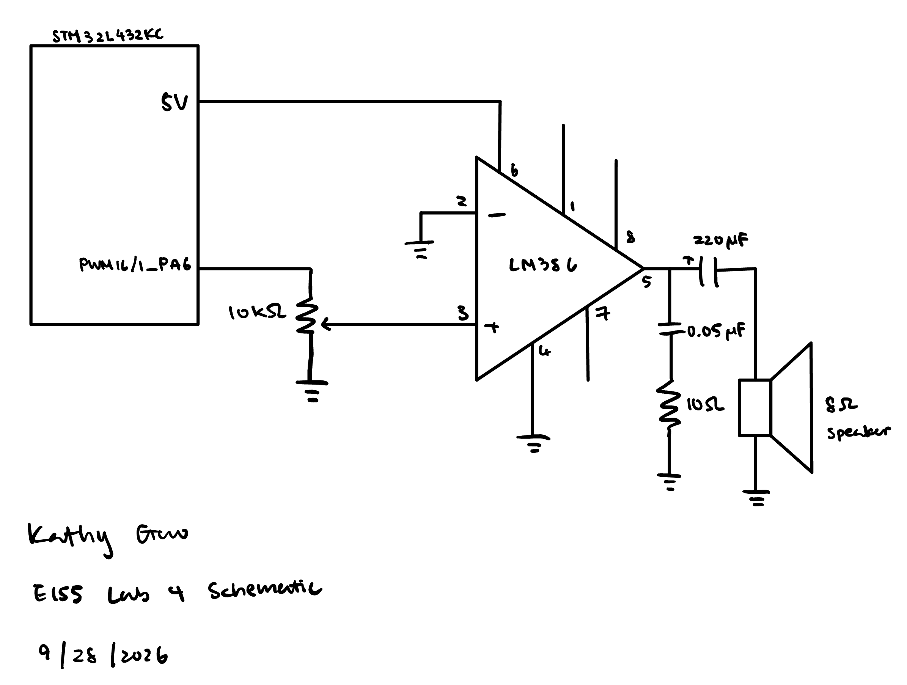

# Introduction
In this lab, C was written to control a digital audio system using a STU32 microcontroller (MCU). The goal is to use the MCU to play music by using timers to generate PWM signals that drives a GPIO pin at a speciffic frequency for specified durations.

# Design and Testing Methodology
The main module makes use of the MSI timer peripher, which is configured to generate a PWM signal at a 24 MHz and 50% duty cycle. The PWM signal is then output to a GPIO pin, which can be connected to an audio amplifier or speaker to produce sound.

# Technical Documentation

The source code for the project can be found in the associated [Github repository](https://github.com/kathy-guo811/e155-lab4).

### Schematic

::: {.callout-note appearance="simple" title="Expand to see Lab 4 Schematic" icon=false collapse="true"}

Figure 1 shows the physical layout of the design. THE PWM signal is generated by the MSI timer and output to a GPIO pin, which is connected to an 8Ω speaker via a LM386 audio amplifier to produce sound. The audio amplifier has current limiting resistors and bypass capacitors to ensure proper operation and prevent damage to the components, as specified in the LM386 datasheet.

:::

#### Frequency Calculations

Frequency can be calculated by the following formula, where PSC is the prescaler value and ARR is the auto-reload register value:
$$f_{PWM} = \frac{f_{timer}}{(PSC + 1) * (ARR + 1)}$$

Since the internal MSI clockhas been set to generate a frequency of 4 MHz and the PSC was set to 3, the ARR value of each notecan be calculated by the following, where f_{PWM} is the desired pitch of the note:
$$ARR = \frac{4 Mhz}{f_{PWM} * (3 + 1)} - 1$$
$$ARR = \frac{1 Mhz}{f_{PWM}} - 1$$

#### Duration Calculations

Since note duration is specified in milliseconds but the clock ticks in microseconds, the duration of each note needs to first be converted to microseconds. Since the period is different for each note, the amount of cycles needed to play th enote for a given duraton need to account for that:
$$cycles = \frac{duration * 1000}{period}$$

#### Example Calculation

For a note with pitch and duration {659, 125}, the ARR value can be calculated as follows:
$$ARR = \frac{1 Mhz}{659 Hz} - 1 = 1515$$
The period of the note can be calculated as follows:
$$period = \frac{1}{659 Hz} = 0.001517 s = 1517 μs$$
The number of cycles needed to play the note for 125 ms can be calculated as follows:
$$cycles = \frac{125 ms * 1000}{1517 μs} = 82 cycles$$

If we multiply the number of cycles by the period, we can verify that the note will be played for the correct duration:
$$duration = 82 cycles * 1517 μs = 124.394 ms$$
This is close enough to the desired duration of 125 ms, and the difference can be attributed to rounding errors in the calculations.

The link to spreadsheet containing all notes in Für Elise can be found [here](https://docs.google.com/spreadsheets/d/1eSddw8ioV9FEWG7ur2RfTrVYbVzipypEZIfqtKNDybA/edit?usp=sharing).

#### Minimum/Maximum Frequency Supported

The minimum and maximum frequencies supported by the design are determined by the range of values that can be set for the ARR register. The ARR register is a 16-bit register, which means it can hold values from 0 to 65535. Therefore:
$$f_{min} = \frac{1 Mhz}{65535 + 1} = 15.26 Hz \rightarrow 16 Hz$$
$$f_{max} = \frac{1 Mhz}{2} = 500 kHz$$

#### Minimum/Maximum Duration Supported

The shortest duration is one period. Since maximum frequency supported is 500 kHz, the shortest duration is 1 ms since duration is initialized as a 32-bit integer in ms units :
$$t_{min} = \frac{1}{500 kHz} = 2 μs\rightarrow 1 ms$$ 

The maximum duration is limited by the 32-bit calculation `duration * 1000`, which becomes:

$$t_{max} = \frac{2^{32}}{1000} \approx 4{,}294{,}967\ \text{ms} \approx 71.6\ \text{min}.$$

Checking 220 HZ and 100 HZ isn't sufficient to prove all notes are within error bounds. The frequency error comes from the truncation during calculation, so it depends on whether the clock's 1 Mhz can divde the given frequency divides "nicely" with a small rounding error.

# Conclusion 

The design successfully implemented the intended functionality of generating a PWM signal to drive a GPIO pin for audio output. The use of timers and proper configuration of the microcontroller allowed for precise control over the frequency and duration of the PWM signal, resulting in clear audio output.

# AI Prototype Summary

::: {.callout-note appearance="simple" title="Expand to see Gemini prompt" icon=false collapse="true"}

What timers should I use on the STM32L432KC to generate frequencies ranging from 220Hz to 1kHz? What’s the best choice of timer if I want to easily connect it to a GPIO pin? What formulae are relevant, and what registers need to be set to configure them properly?
:::

The quality of the output looks decent as it contians the relavant frequency formula to compute ARR and PSC, as well as registers needed from generating a frequency all the way to outputing a PWM to a GPIO.

The speed of the LLM is significantly faster than manually reading over the datasheet, and it does help with navigating the datasheet when trying to find a specific register that may be referenced hundres of times in the datasheet.

All the code that Gemini generated are for assigning them to a specific number to perform a specific task. 

Gemini chose to use TIM2, as it is a 32-bit general-purpose timer connected to standard GPIO pins (PA0/PA5) via Alternate Function mappings (AF1). It gives you extreme resolution and flexibility without overflowing. However, I thought TIM2 cannot generate PWMs, therefore I chose TIM16.

Gemini did work well for document search, but I think further prompting or manual datasheet search is still necesary to have an understanding of the complete capabilities of a register.