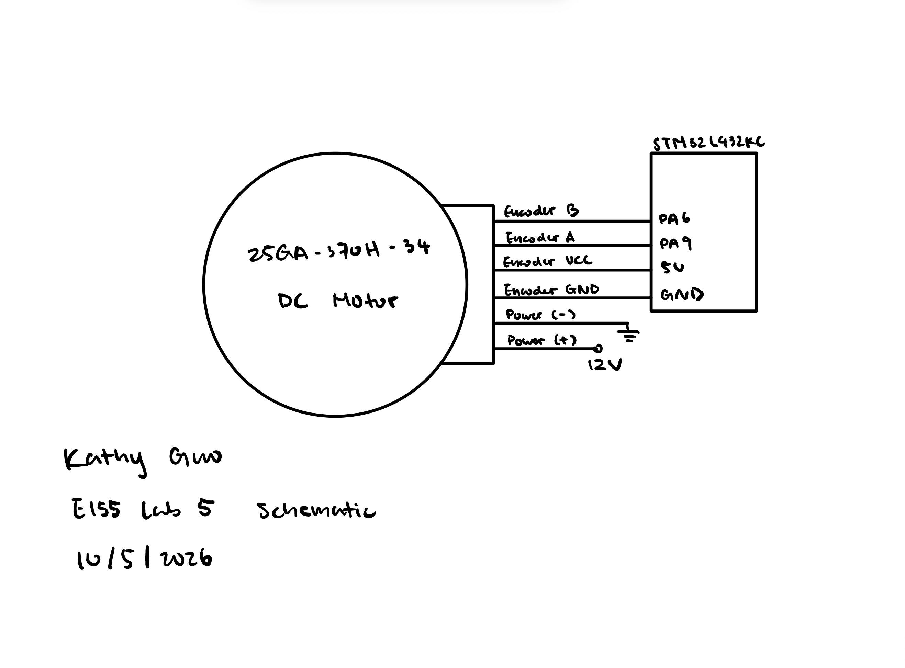
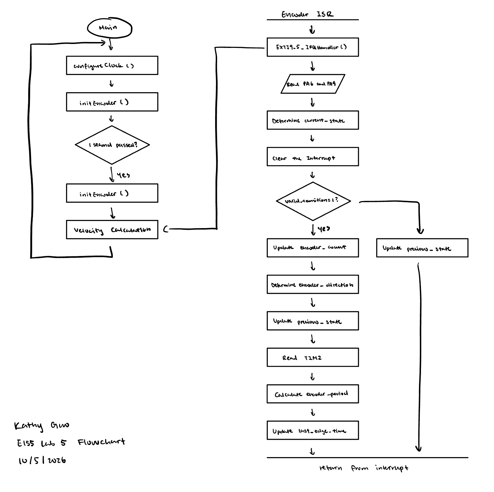

# Introduction
In this lab, C was written to control a MCU to determine the speed of a motor by reading from a quadrature encoder using interrupts.

# Design and Testing Methodology
The main module configures the clock to 80Mhz, initializes encoder inputs and interrupts, and then uses the encoder inputs to determine the speed of a motor. The speed is calculated by measuring the time between encoder pulses or the number of pulses between interrupts and converting that to a speed value.

# Technical Documentation

The source code for the project can be found in the associated [Github repository](https://github.com/kathy-guo811/e155-lab5).

### Schematic

::: {.callout-note appearance="simple" title="Expand to see Lab 5 Schematic" icon=false collapse="true"}



Figure 1 shows the how the motor and the quadrature encoder are connected to the MCU. The quadrature encoder has two channels, A and B, which are connected to 5V GPIO pins on the MCU. The motor is connected to a 12V power supply, and by switching power connection, the motor can be made to spin in either direction, and the speed of the motor can be controlled by adjusting the voltage supplied to the motor.

:::


### Velocity Calculations

#### Low Velocity Calculations

Low velocity is calculated by measuring the time between encoder pulses. The time between pulses can be measured using a timer, and the speed can be calculated using the following formula:
$$v = \frac{1}{ \frac{encoder\_period}{10000}*COUNTS\_PER\_REV}$$

#### High Velocity Calculations
High velocity is calculated by measuring the number of encoder pulses between each 1hz readout. The speed can be calculated using the following formula:
$$v = \frac{count\_change}{ \frac{time\_change}{10000}*COUNTS\_PER\_REV}$$

#### Update Rate Calculations
Since TIM2 is running at 10000 counts/ms, and the main loop updates if `(time_change >= 10000)`, the update rate is 1 Hz. The update rate and sampling frequency can be calculated using the following formula:

$T_{update} = \frac{1}{ \frac{time\_change}{10000}}$ = 1 
$f_{update} = \frac{1}{T_{update}}$ = 1 Hz

### Flowchart

::: {.callout-note appearance="simple" title="Expand to see Lab 5 Flowchart" icon=false collapse="true"}



:::


#### Interrupt-Based Code vs. Manual Polling

As indicated by the counts below, the manual polling code is not able to keep up with the encouder pulses at high speeds, resulting in missing counts and inaccurate speed measurements. The interrupt-based code, on the other hand, is able to accurately count the encoder pulses and calculate the speed of the motor.

::: {layout-ncol=2}

```{.txt}
Interrupt-Based Code Counts

Direction: CCW, Velocity: 2.852329 rev/sec, Count: 4655
Direction: CCW, Velocity: 2.848039 rev/sec, Count: 4648
Direction: CCW, Velocity: 2.851716 rev/sec, Count: 4654
Direction: CCW, Velocity: 2.852941 rev/sec, Count: 4656
Direction: CCW, Velocity: 2.851716 rev/sec, Count: 4654
```

```{.txt}
Manual Polling Code Counts

Count: -4621
Count: -4620
Count: -4636
Count: -4646
Count: -4646
```

:::
# Conclusion 

The design successfully implemented the intended functionality of using interrupts to read from a quadrature encoder and calculate the speed of a motor. The measured velcoity at 12V was 2.85 rev/sec, which is consistent with the expected speed of the motor. 

# AI Prototype Summary

::: {.callout-note appearance="simple" title="Expand to see C code generated by Gemini" icon=false collapse="true"}

```
/#include "stm32l4xx_hal.h"

/* Global Encoder Counter */
volatile int32_t g_encoder_count = 0;

/* Private Function Prototypes */
void SystemClock_Config(void);
static void MX_GPIO_Init(void);
static void Error_Handler(void);

int main(void)
{
    /* Reset of all peripherals, Initializes the Flash interface and the Systick. */
    HAL_Init();

    /* Configure the system clock (80 MHz) */
    SystemClock_Config();

    /* Initialize GPIOs and Interrupts for PA0 and PA1 */
    MX_GPIO_Init();

    while (1)
    {
        /* Access 'g_encoder_count' anywhere in your main loop */
        // Example: int32_t current_pos = g_encoder_count;
    }
}

/**
  * @brief GPIO Initialization Function
  * @param None
  * @retval None
  */
static void MX_GPIO_Init(void)
{
    GPIO_InitTypeDef GPIO_InitStruct = {0};

    /* Enable GPIOA Clock */
    __HAL_RCC_GPIOA_CLK_ENABLE();

    /* Configure PA0 (Channel A) and PA1 (Channel B) as EXTI Rising/Falling */
    GPIO_InitStruct.Pin = GPIO_PIN_0 | GPIO_PIN_1;
    GPIO_InitStruct.Mode = GPIO_MODE_IT_RISING_FALLING;
    GPIO_InitStruct.Pull = GPIO_PULLUP; // Change to GPIO_NOPULL if external pull-ups exist
    HAL_GPIO_Init(GPIOA, &GPIO_InitStruct);

    /* EXTI interrupt init for PA0 */
    HAL_NVIC_SetPriority(EXTI0_IRQn, 2, 0);
    HAL_NVIC_EnableIRQ(EXTI0_IRQn);

    /* EXTI interrupt init for PA1 */
    HAL_NVIC_SetPriority(EXTI1_IRQn, 2, 0);
    HAL_NVIC_EnableIRQ(EXTI1_IRQn);
}

/**
  * @brief Interrupt Service Routine for EXTI Line 0 (PA0)
  */
void EXTI0_IRQHandler(void)
{
    HAL_GPIO_EXTI_IRQHandler(GPIO_PIN_0);
}

/**
  * @brief Interrupt Service Routine for EXTI Line 1 (PA1)
  */
void EXTI1_IRQHandler(void)
{
    HAL_GPIO_EXTI_IRQHandler(GPIO_PIN_1);
}

/**
  * @brief EXTI line detection callback
  * @param GPIO_Pin Specfies the pin connected to the EXTI line
  */
void HAL_GPIO_EXTI_Callback(uint16_t GPIO_Pin)
{
    if (GPIO_Pin == GPIO_PIN_0 || GPIO_Pin == GPIO_PIN_1)
    {
        static uint8_t last_state = 0;

        /* Read current state of both channels */
        uint8_t chA = (HAL_GPIO_ReadPin(GPIOA, GPIO_PIN_0) == GPIO_PIN_SET) ? 1 : 0;
        uint8_t chB = (HAL_GPIO_ReadPin(GPIOA, GPIO_PIN_1) == GPIO_PIN_SET) ? 1 : 0;
        uint8_t current_state = (chA << 1) | chB;

        /* Quadrature state transition lookup table (4x decoding)
         * Index formed by: (last_state << 2) | current_state
         *  0: No move
         * +1: Clockwise step
         * -1: Counter-clockwise step
         */
        static const int8_t quad_table[16] = {
             0, -1,  1,  0,
             1,  0,  0, -1,
            -1,  0,  0,  1,
             0,  1, -1,  0
        };

        uint8_t index = ((last_state & 0x03) << 2) | (current_state & 0x03);
        g_encoder_count += quad_table[index];

        last_state = current_state;
    }
}

/**
  * @brief System Clock Configuration (80 MHz SYSCLK using HSI/PLL)
  */
void SystemClock_Config(void)
{
    RCC_OscInitTypeDef RCC_OscInitStruct = {0};
    RCC_ClkInitTypeDef RCC_ClkInitStruct = {0};

    /** Configure the main internal regulator output voltage */
    if (HAL_PWREx_ControlVoltageScaling(PWR_REGULATOR_VOLTAGE_SCALE1) != HAL_OK)
    {
        Error_Handler();
    }

    /** Initializes the RCC Oscillators */
    RCC_OscInitStruct.OscillatorType = RCC_OSCILLATORTYPE_HSI;
    RCC_OscInitStruct.HSIState = RCC_HSI_ON;
    RCC_OscInitStruct.HSICalibrationValue = RCC_HSICALIBRATION_DEFAULT;
    RCC_OscInitStruct.PLL.PLLState = RCC_PLL_ON;
    RCC_OscInitStruct.PLL.PLLSource = RCC_PLLSOURCE_HSI;
    RCC_OscInitStruct.PLL.PLLM = 1;
    RCC_OscInitStruct.PLL.PLLN = 10;
    RCC_OscInitStruct.PLL.PLLP = RCC_PLLP_DIV7;
    RCC_OscInitStruct.PLL.PLLQ = RCC_PLLQ_DIV2;
    RCC_OscInitStruct.PLL.PLLR = RCC_PLLR_DIV2;
    if (HAL_RCC_OscConfig(&RCC_OscInitStruct) != HAL_OK)
    {
        Error_Handler();
    }

    /** Initializes the CPU, AHB and APB buses clocks */
    RCC_ClkInitStruct.ClockType = RCC_CLOCKTYPE_HCLK | RCC_CLOCKTYPE_SYSCLK
                                | RCC_CLOCKTYPE_PCLK1 | RCC_CLOCKTYPE_PCLK2;
    RCC_ClkInitStruct.SYSCLKSource = RCC_SYSCLKSOURCE_PLLCLK;
    RCC_ClkInitStruct.AHBCLKDivider = RCC_SYSCLK_DIV1;
    RCC_ClkInitStruct.APB1CLKDivider = RCC_HCLK_DIV1;
    RCC_ClkInitStruct.APB2CLKDivider = RCC_HCLK_DIV1;

    if (HAL_RCC_ClockConfig(&RCC_ClkInitStruct, FLASH_LATENCY_4) != HAL_OK)
    {
        Error_Handler();
    }
}

/**
  * @brief SysTick Interrupt Handler required by HAL
  */
void SysTick_Handler(void)
{
    HAL_IncTick();
}

static void Error_Handler(void)
{
    __disable_irq();
    while (1)
    {
    }
}
```

:::

The LLM-generated code was not able to build because the header file 'stm32l4xx_hal.h' was not found.

The LLM-generated code that uses the STM32 HAL library to configure GPIO interrupts for reading a quadrature encoder, and the encoder ISR defines a static constnat 2D array to implement a quadrature state transition lookup table for 4x decoding. The ISR reads the current state of both channels, calculates the index into the lookup table, and updates the global encoder count accordingly. This is different and more efficient than my original implementation that uses if-else statements to determine the direction of rotation and update the encoder count. 

The LLM advised using Hardware Timer Encoder Mode (TIM1 / TIM2) over GPIO interrupts because hardware counters perform 4x quadrature decoding directly in silicon without triggering CPU interrupts, eliminating step-loss at high RPMs. My reasoning for using TIM2 is that it is a 32-bit timer, which allows for a larger range of counts before overflow, and it is also a general-purpose timer that can be used for other purposes in the future.

The LLM does not provide that much explanation that justified its design choices (i.e. choosing which timer and which GPIO pins), but what it does provide is a good starting point for implementing a quadrature encoder using interrupts. 